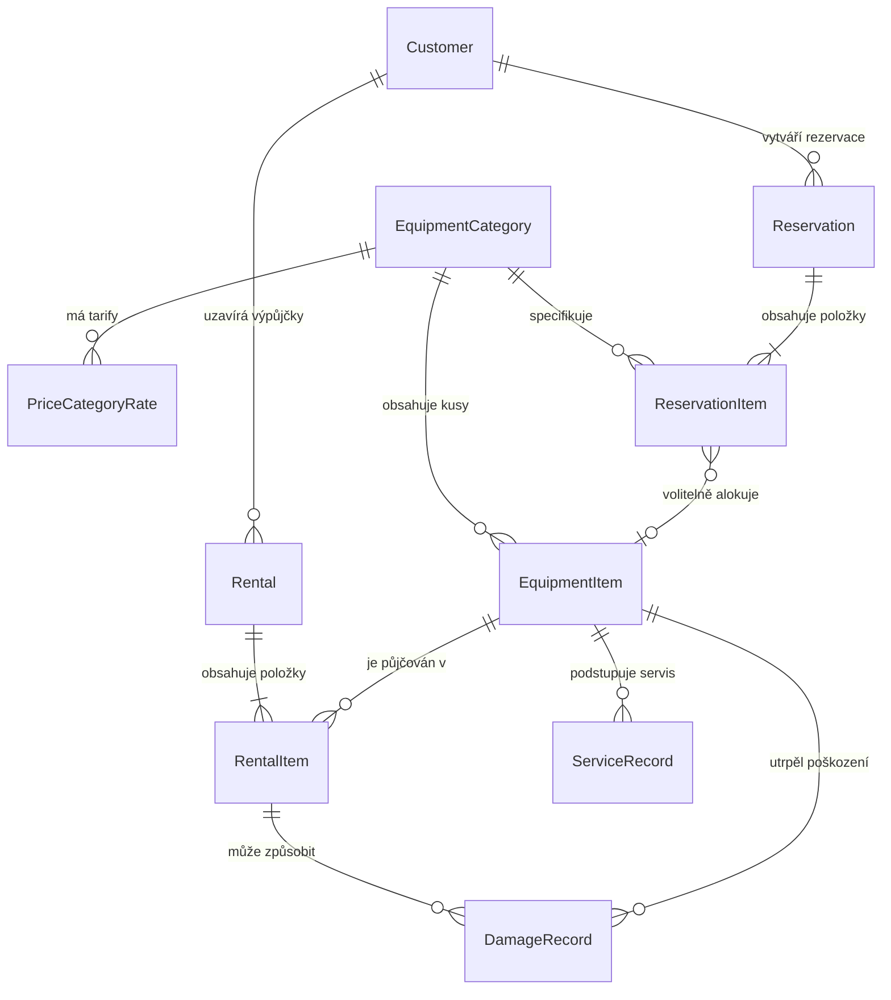

# Půjčovna vybavení „Hory a voda“ (PPRO 2026/2027)

> **Semestrální projekt předmětu Pokročilé programování (PPRO)**  
> Fakulta informatiky a managementu, Univerzita Hradec Králové (ZS 2026/2027)  
> **Vybrané zadání**: Zadání D – Půjčovna vybavení  
> **Jediný zdroj pravdy (Single Source of Truth) a technická dokumentace projektu**

---

## 1. Kontext a zadání klienta

- **Klient**: Martin Řehák, půjčovna *Hory a voda*.
- **Činnost**: Půjčování zimního (lyže, snowboardy, boty, hole) a letního vybavení (lodě, pádla, vesty). Sezóna je krátká, nárazová a o víkendech se tvoří dlouhé fronty.
- **Původní stav**: Papírový sešit, inventární čísla napsaná lihovkou přímo na vybavení, telefonické rezervace zaznamenávané na lístečky nad pultem. Dochází k chybám (dvojitá rezervace stejného kusu lyží), v ranní špičce vzniká chaos a klient situaci řeší improvizovanými slevami.

---

## 2. Přehled požadavků

### 2.1 Funkční požadavky (Co klient chce)
1. **Jednotlivé kusy vybavení**: Každý kus má inventární číslo, kategorii, velikost, rok pořízení a aktuální stav opotřebení. Dva totožné páry lyží tvoří dva samostatné záznamy.
2. **Kategorie vybavení**: Lyže, snowboardy, boty, hole, lodě, vesty apod. Cenotvorba se odvíjí od kategorie.
3. **Zákazníci**: Evidence zákazníků (jméno, příjmení, telefon, číslo dokladu totožnosti, výše a složení kauce).
4. **Výpůjčky**: Výpůjčka obsahuje více kusů vybavení, eviduje sjednané období (od – do) a tentýž inventární kus se v čase půjčuje opakovaně.
5. **Rezervace předem**: Rezervace termínu dopředu (např. telefonát v úterý na víkend).
6. **Vrácení po částech**: Možnost vrátit část výpůjčky dříve (např. lyže vráceny v poledne, boty až večer).
7. **Servisní evidence**: Vyřazení kusu z oběhu po dobu servisu. Přehled o tom, které kusy jsou v servisu a jak dlouho.
8. **Ceník podle kategorie a počtu dní**: Flexibilní ceník; víkend se počítá jako dva dny s vyzvednutím již v pátek odpoledne.
9. **Manažerské přehledy**:
   - Co je aktuálně vypůjčeno („venku“).
   - Co mělo být vráceno a nebylo (prodlení).
   - Frekvence výpůjček jednotlivých kusů (podklad pro nákup a obnovu fondu).
   - Ranní přehled volného vybavení na pultu.

### 2.2 Obchodní pravidla (Na čem klient trvá)
- **Zákaz kolize termínů**: Jeden kus nesmí být přiřazen ve dvou překrývajících se výpůjčkách či rezervacích.
- **Blokace servisu**: Kus nacházející se ve stavu servisu nelze půjčit ani pro něj potvrdit rezervaci.
- **Penalizace za prodlení**: Za pozdní vrácení je automaticky účtováno penále za každý započatý den prodlení.
- **Nenávratnost historie**: Historie výpůjček a servisních úkonů se fyzicky nemaže (slouží pro reklamace a analýzu životnosti).

### 2.3 Přání a nálady klienta (Co klient prohodil mimochodem)
- *„Nejvíc mi pomůže, když v sobotu ráno uvidím na jedné obrazovce, co je volné.“* $\rightarrow$ Dashboard dostupnosti na hlavní obrazovce.
- *„Kauci beru v hotovosti, to do počítače dávat nemusíme.“* $\rightarrow$ Systém eviduje stav složené/vrácené kauce pro případné započtení škody, ale nefunguje jako pokladní terminál.
- *„Někdy dám slevu, to je moje věc.“* $\rightarrow$ Možnost zadat manuální slevu na celou výpůjčku či položku.
- *„Kdyby to šlo tisknout, tak bych tiskl smlouvu.“* $\rightarrow$ Generování tiskového protokolu/smlouvy o výpůjčce.

---

## 3. Rozhodnutí k otevřeným bodům zadání (Architecture Decision Records)

Tento oddíl formalizuje rozhodnutí pro 5 klíčových neujasněných bodů zadání vyžadovaných specifikací PPRO.

### Rozhodnutí 1: Rezervace – konkrétní kus vs. typ vybavení („Kde se návrh láme“)
- **Kontext**: Zákazník při telefonátu požaduje např. „lyže 170 cm“, nikoliv inventární číslo 412. Přímé vázání rezervace na jeden konkrétní kus vytváří rigidní systém náchylný k selhání (např. při neplánovaném servisu daného kusu).
- **Rozhodnutí**: Systém implementuje **dvoufázový model alokace kapacity**:
  1. *Fáze rezervace*: Zákazník rezervuje **typ a velikostní kategorii** (např. Kategorie: Sjezdové lyže, Velikost: 170 cm). Systém ověří dostupnou kapacitu v daném termínu a vytvoří rezervaci (`ReservationItem`), která sníží volnou kapacitu pro daný slot.
  2. *Fáze výdeje*: Při fyzickém převzetí zákazníkem na přepážce systém nabídne volné kusy odpovídající specifikaci a obsluha naskenuje/přiřadí konkrétní inventární kus (`EquipmentItem`), čímž se vytvoří aktivní položka výpůjčky (`RentalItem`). Pro specifické požadavky (VIP zákazník trvá na konkrétním modelu) systém volitelně umožňuje i před-přiřazení konkrétního kusu.
- **Důvod**: Odstraňuje zmatky při ranním odbavování, umožňuje flexibilní záměnu kusů stejné specifikace a zabraňuje neoprávněnému blokování celého provozu.

### Rozhodnutí 2: Platnost rezervace a expirace („do desíti“)
- **Kontext**: Rezervace na víkend jsou obvykle drženy do určité hodiny (např. 10:00), po které hrozí, že nevyzvednuté kusy zablokují odbavení čekajících zájemců ve frontě.
- **Rozhodnutí**: Rezervace má explicitní atribut `validUntil` (datum a čas). Po uplynutí termínu (s konfigurovatelnou tolerancí 15 minut) je rezervace v přehledu označena jako **prošlá** a systém umožní její automatické i manuální stornování (`EXPIRED`), čímž se kapacita okamžitě uvolní do volného fondu pro zákazníky na prodejně. Obsluha má možnost u rezervace zaznamenat telefonické prodloužení platnosti jedním kliknutím.
- **Důvod**: Chrání půjčovnu před ušlým ziskem v ranní špičce, kdy před obchodem stojí fronta.

### Rozhodnutí 3: Evidence poškození a vazba na kauci
- **Kontext**: Poškození je dosud evidováno neformálně. Je nutné určit, zda se váže ke kusu, k výpůjčce, nebo ke kauci.
- **Rozhodnutí**: Zavádí se samostatná entita `DamageRecord`. Poškození se primárně váže ke konkrétnímu inventárnímu kusu (`EquipmentItem`) a konkrétní položce výpůjčky (`RentalItem`). Záznam obsahuje popis vady, fotodokumentaci/poznámku a finanční vyčíslení škody. Tato škoda je při vyrovnání automaticky odečtena z vratné kauce zákazníka. Zároveň se stav opotřebení daného kusu přehodnotí, a pokud je poškození vážné, je kus automaticky přesunut do stavu `IN_SERVICE`.
- **Důvod**: Zajišťuje právní i finanční dohledatelnost (kdo škodu způsobil a jak byla uhrazena) a zároveň udržuje reálný technický stav vybavení.

### Rozhodnutí 4: Částečné vrácení a penalizace
- **Kontext**: Zákazník může vrátit část vypůjčených položek dříve než zbytek (např. lyže v poledne, boty až večer nebo další den).
- **Rozhodnutí**: Každá položka výpůjčky (`RentalItem`) vystupuje jako samostatně stavový prvek s vlastním časem vrácení (`returnedAt`) a stavem (`BORROWED`, `RETURNED`, `LATE_RETURNED`). Výpůjčka (`Rental`) zůstává ve stavu `ACTIVE` až do vrácení poslední položky. Penále za pozdní vrácení se počítá **odděleně za každý nevrácený kus** podle denní sazby jeho kategorie za každý započatý den prodlení.
- **Důvod**: Férový a transparentní výpočet pro zákazníka (neplatí penále za kusy, které vrátil včas) a přesná evidence, co se ještě nachází u zákazníka.

### Rozhodnutí 5: Změna ceníku během sezóny a fixace cen
- **Kontext**: Ceník se v průběhu roku mění, avšak dříve sjednané smlouvy a rezervace musí zachovat původní cenu.
- **Rozhodnutí**: Ceník (`PriceList` / `PriceCategoryRate`) funguje jako katalog. V momentě vytvoření rezervace či výpůjčky systém provede **cenový snapshot** – sjednané částky (denní sazba, záloha, sleva) se uloží přímo do záznamu `ReservationItem` a `RentalItem`. Pozdější editace globálního ceníku nijak neovlivní již vystavené záznamy.
- **Důvod**: Právní jistota, neměnnost uzavřených obchodních smluv a čistá auditní stopa pro účetnictví.

---

## 4. Doménový a datový model

Systém splňuje povinné minimum: obsahuje více než 5 provázaných entit a několik vazeb M:N.

### 4.1 Klíčové entity
1. **EquipmentCategory**: Kategorie vybavení (např. Sjezdové lyže, Běžky, Snowboardy, Kanoe, Vesty). Definuje standardní sazby a parametry.
2. **EquipmentItem**: Konkrétní fyzický inventární kus (unikátní inventární číslo, kategorie, model/specifikace, velikost, rok pořízení, stav opotřebení, aktuální status: `AVAILABLE`, `RESERVED`, `RENTED`, `IN_SERVICE`, `RETIRED`).
3. **Customer**: Zákazník půjčovny (jméno, příjmení, telefon, e-mail, číslo dokladu totožnosti, poznámka o spolehlivosti).
4. **Rental**: Smlouva o výpůjčce (zákazník, datum a čas zahájení, plánované datum vrácení, celková složená kauce, celková sleva, finální status).
5. **RentalItem**: Vazební M:N entita mezi `Rental` a `EquipmentItem`. Nese sjednanou denní sazbu, skutečný čas vrácení, stav položky a případné vypočtené penále.
6. **Reservation**: Rezervace termínu dopředu (zákazník, datum od, datum do, čas expirace `validUntil`, stav: `PENDING`, `CONFIRMED`, `FULFILLED`, `CANCELLED`, `EXPIRED`).
7. **ReservationItem**: Požadavek v rezervaci (kategorie vybavení, požadovaná velikost, volitelná alokace konkrétního kusu).
8. **ServiceRecord**: Servisní záznam pro inventární kus (datum zahájení, datum ukončení, popis provedených oprav, náklady, provádějící technik).
9. **DamageRecord**: Protokol o poškození inventárního kusu při výpůjčce (vazba na položku výpůjčky, popis škody, stržená částka z kauce).
10. **PriceCategoryRate**: Matice cen pro kategorii a délku výpůjčky (např. sazba na 1 den, víkendový tarif, týdenní tarif).

### 4.2 Entity Relationship Diagram (Mermaid)



---

## 5. Architektura systému a technologický stack

Projekt je navržen v souladu s principy **třívrstvé architektury** se striktně jednosměrnými závislostmi:

```
[ Prezentační vrstva: Pultový Web Dashboard & FastAPI REST API ]
                                │
                                ▼
[ Aplikační vrstva: EquipmentService, Validace DTO, Byznys pravidla ]
                                │
                                ▼
[ Datová vrstva: SQLAlchemy Modely, Repozitáře, PostgreSQL / SQLite ]
```

### 5.1 Zvolený technologický stack
- **Jazyk a běhové prostředí**: Python 3.12+ (asynchronní framework **FastAPI**)
- **ORM & Perzistence**: SQLAlchemy 2.0 (s podporou verzovaných schémat a migrací)
- **Relační databáze**: PostgreSQL 16 (běžící v kontejneru Docker Compose), SQLite s podporou sdíleného `StaticPool` pro bleskové lokální testování
- **Validace a typování**: Pydantic v2
- **Prezentační vrstva (UI)**: Moderní pultový webový dashboard (HTML5, responzivní Vanilla CSS, nativní JavaScript)
- **Vizuální styl**: Čistý, minimalistický design bez jakýchkoliv ikonek a emoji – rozhraní sází na jasnou textovou hierarchii, čistou typografii a barevné stavové indikátory pro maximální přehlednost na pultu.
- **Motivy rozhraní**: Plná podpora přepínání mezi **Dark módem** a **Light módem** s okamžitou perzistencí uživatelské volby v `localStorage`.
- **Testovací framework**: `pytest` + `httpx` (unit testy byznys služeb a integrační testy REST API)
- **Kontejnerizace**: Docker & Docker Compose

---

## 6. První funkční demo: Správa entit inventáře (`EquipmentItem`)

Pro ověření konceptu a první předvedení klientovi Martinu Řehákovi bylo vyvinuto funkční demo zaměřené na klíčovou entitu **Kus vybavení (`EquipmentItem`)**.

### 6.1 Proč právě tato entita
- Zhmotňuje základní požadavek klienta: *„V sobotu ráno uvidím na jedné obrazovce, co je volné.“*
- Realizuje pravidlo: *„Dva stejné páry lyží jsou dva záznamy s unikátním inventárním číslem.“*
- Vynucuje klíčová obchodní pravidla:
  - Zákaz duplicity inventárních čísel (lihovkou psaná čísla na vybavení).
  - **Kus v servisu se nepůjčuje**: Systém odmítne zapůjčit kus, který je ve stavu servisu.
  - Zákaz záporných denních sazeb.
  - Odeslání do dílny/servisu se zaznamenáním důvodu a návrat na pult s přehodnocením stavu opotřebení.

### 6.2 Syntetická data
Aplikace při startu automaticky naplní databázi (pokud je prázdná) sadou 14 realistických položek:
- Sjezdové lyže (*Atomic Redster G9*, *Salomon S/Max 10*, *Head Supershape e-Magnum*)
- Snowboardy (*Salomon Craft*, *Burton Custom Camber*)
- Lyžařské boty (*Dalbello Panterra 100*, *Salomon S/Pro 90 W*, *Atomic Hawx Prime 110*)
- Hole (*Leki Spark S*)
- Letní vybavení (*Kanoe Vydra 2-místná*, *Raft Colorado 450*, *Plovací vesty Hiko*)

Kusy jsou nasimulovány v různých stavech (`Dostupné`, `Vypůjčeno`, `V servisu`), což umožňuje okamžitou prezentaci funkčnosti filtrace a ranního pultu.

---

## 7. Společné minimum předmětu PPRO

| Požadavek PPRO | Splnění v projektu |
|---|---|
| **Třívrstvá architektura** | Implementována s jednosměrnými závislostmi (`api` $\rightarrow$ `services` $\rightarrow$ `domain`/`infrastructure`). |
| **Relační databáze v Dockeru** | PostgreSQL běžící v kontejneru v rámci `docker compose`. |
| **Databázové migrace** | Správa verzí databázového schématu pomocí migračních nástrojů. |
| **Nejméně 5 entit** | Cílový model obsahuje 10 plnohodnotných doménových entit; demo ověřuje základní entitu `EquipmentItem`. |
| **Alespoň jedna vazba M:N** | Vazba mezi `Rental` a `EquipmentItem` přes entitu `RentalItem` s dodatečnými atributy. |
| **Testy** | Unit testy byznys pravidel a integrační testy REST API (`pytest` – 9 testů, 100% průchod). |
| **Spuštění `docker compose up`** | Kompletní stack (databáze + aplikační backend) startuje jediným příkazem. |
| **Syntetická data** | Seeding skripty generují výhradně realistická syntetická data; žádné reálné osobní údaje. |

---

## 8. Návod na spuštění a testování

### 8.1 Spuštění v Dockeru (doporučeno pro odevzdání)
```bash
docker compose up --build -d
```
Aplikace poběží na:
- **Pultový dashboard pro klienta**: `http://localhost:8000`
- **Interaktivní Swagger API**: `http://localhost:8000/docs`

### 8.2 Lokální spuštění bez Dockeru (rychlý vývoj)
1. Nainstalujte závislosti:
   ```bash
   pip install -r requirements.txt
   ```
2. Spusťte aplikaci:
   ```bash
   python -m uvicorn src.main:app --reload --port 8000
   ```
3. Otevřete v prohlížeči `http://localhost:8000`.

### 8.3 Spuštění automatizovaných testů
```bash
python -m pytest -v
```

---

## 9. Záznamy o postupu a změnách (Changelog & Technical Log)

- **2026-10-07**:
  - Vyřešení spouštění Uvicornu a konfigurace běhového prostředí Python pro Windows / Bash.
  - Vytvoření spouštěcích skriptů `run.sh` (pro bash/Git Bash) a `run.bat` (pro Windows CMD).
  - **Minimalistický vizuální refaktoring rozhraní**:
    - Kompletní odstranění všech ikonek i emoji z celého projektu (tlačítka, stavové karty, pultový dashboard, notifikace i dialogy).
    - Rozhraní převedeno na čistý, profesionální textový design s akcentními barevnými liniemi pro stavy inventáře.
  - **Implementace Light módu**:
    - Vytvořen kompletní světlý vizuální motiv (`[data-theme="light"]`) v CSS design systému.
    - Přidán přepínač Dark/Light módu na horní liště s ukládáním do `localStorage`.


- **2026-09-30**:
  - Inicializace Git repozitáře a napojení na vzdálený repozitář `https://github.com/Corsomexx/ppro2026.git`.
  - Definice projektových pravidel pro AI asistenta v [AGENTS.md](file:///u:/ppro2026/AGENTS.md).
  - Vytvoření autoritativní technické dokumentace `README.md` pro **Zadání D: Půjčovna vybavení**.
  - Zpracování všech 5 architektonických rozhodnutí k otevřeným bodům klienta.
  - Nastavení pre-commit hooku pro kontrolu aktualizace technické dokumentace.
  - **Implementace prvního funkčního dema**:
    - Výběr technologického stacku: **Python s FastAPI + SQLAlchemy**.
    - Zavedení 3-vrstvé architektury: `src/domain`, `src/infrastructure`, `src/services`, `src/api`, `src/static`.
    - Implementace klíčové entity `EquipmentItem` (inventární čísla, velikosti, opotřebení, denní sazby, stavový automat).
    - Vynucení byznys pravidel (unikátnost inv. čísla, zákaz půjčení kusu v servisu, validace stavových přechodů).
    - Vytvoření moderního pultového webového dashboardu pro rychlý ranní přehled (karty dostupnosti, filtrace, servisní modál).
    - Sada 9 automatizovaných testů (unit + integrační) v `pytest`.
    - Konfigurace `Dockerfile` a `docker-compose.yml` s PostgreSQL.


